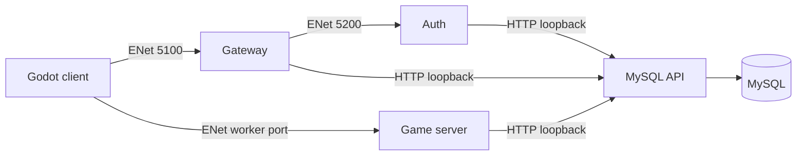
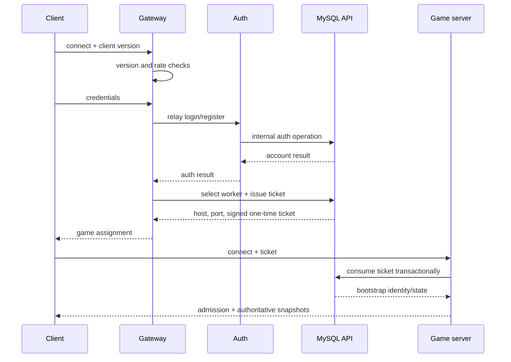
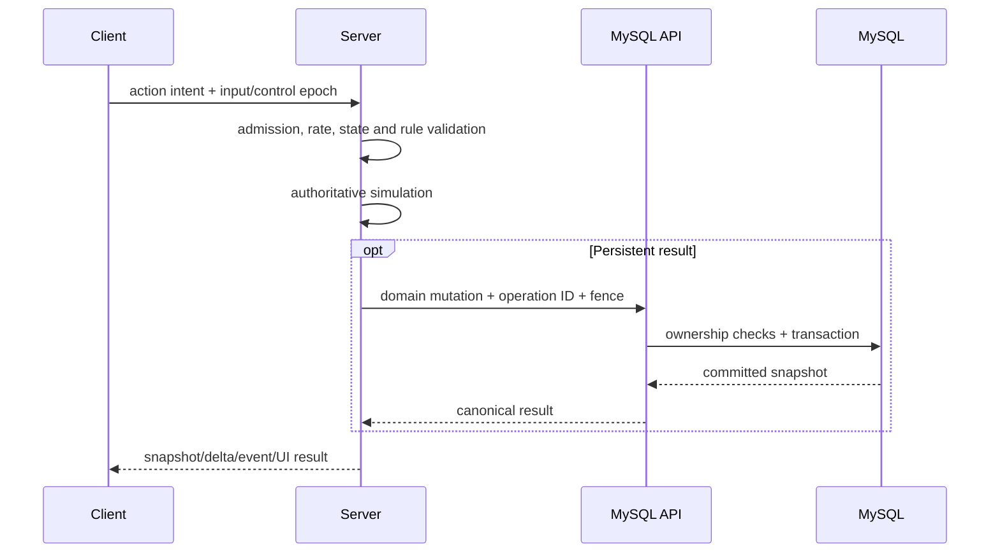
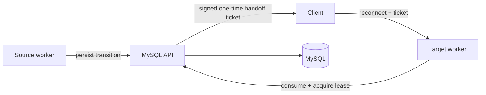

# Datamoons Online - Server Architecture

## Purpose

This document defines the working architecture across the Datamoons Online runtime repositories.

It exists to keep new features aligned with the current service boundaries.

---

## Runtime Overview

The project currently operates as a multi-repo game stack with separate responsibilities:

- `datamoon-online-auth`
- `datamoon-online-gateway`
- `datamoon-online-server`
- `datamoon-online-mysqlapi`
- `datamoon-online-client`
- `datamoon-online-web`

For the active beta stack, the core gameplay services are:

- `datamoon-api`
- `datamoon-auth`
- `datamoon-gateway`
- `datamoon-server`

`datamoon-web` may remain disabled during beta when it is not part of the live gameplay loop.

---

## Responsibility Split

### Auth

`datamoon-online-auth` should own:

- authentication-adjacent runtime behavior;
- token/session-oriented checks;
- connection flow support for gameplay entry.

It should not become the hidden owner of unrelated gameplay systems.

### Gateway

`datamoon-online-gateway` should own:

- initial connection flow;
- handoff-oriented responsibilities;
- network boundary concerns that are not full gameplay authority.

It should not silently become a second game server.

### Server

`datamoon-online-server` is the gameplay authority.

It should own:

- world simulation;
- combat;
- chunks and visibility;
- quests;
- dungeons;
- party and guild gameplay state;
- NPC and portal interaction rules;
- reward distribution;
- player-to-world logic.

### MySQL API

`datamoon-online-mysqlapi` is the persistence boundary.

It should own:

- validated game persistence operations;
- migrations;
- controlled inventory mutations;
- character, Datamoon, guild, quest, and economy persistence;
- internal HTTP contracts for game services.

It should not be used as the real-time combat loop authority.

### Client

`datamoon-online-client` should own:

- input;
- UI;
- camera;
- interpolation;
- VFX and SFX;
- player-facing presentation;
- local usability features.

It should not be trusted as the final authority for persistent or competitive outcomes.

---

## Data Flow

The common pattern should be:

1. Client sends an action request to the gameplay server.
2. Server validates live gameplay conditions.
3. Server resolves the gameplay result.
4. If persistence is needed, server calls mysqlapi.
5. Server sends player feedback and updated snapshots.

This keeps moment-to-moment authority in the gameplay server and long-term state in mysqlapi.

---

## Architectural Defaults

Prefer these defaults unless code clearly establishes a newer pattern:

- Godot gameplay services are headless runtime authorities;
- mysqlapi is the only safe place for database mutations;
- JSON-driven content definitions are preferred for tuneable gameplay data;
- mirrored RPC contracts between client and server must stay synchronized;
- major gameplay state should be reconstructable from server truth and persisted snapshots.

---

## Where New Features Belong

Use this routing rule:

- if it changes live world behavior, it likely belongs in `datamoon-online-server`;
- if it changes persistence semantics, it likely needs mysqlapi work;
- if it changes connection or auth flow, it likely touches `auth` or `gateway`;
- if it only changes presentation, it likely belongs in `client`;
- if it introduces cross-repo assumptions, document them in the agent docs and decision log.

Do not place a feature in a repo just because it is faster there.

---

## Content Architecture

The server already uses data-driven content patterns for systems such as:

- quests;
- dungeons;
- NPC definitions;
- item catalogs;
- reward tables;
- recipes;
- enemy spawn definitions.

Prefer extending those content pipelines before writing hardcoded one-off gameplay branches.

---

## Operational Rules

The current deployment model uses:

- `pbe` for active gameplay services;
- `main` for repos that are not following the beta runtime track in the same way;
- headless Godot runtime for auth, gateway, and server;
- a compiled Go binary for mysqlapi.

When changing runtime-sensitive behavior, always consider:

- local and VM parity;
- Godot version parity;
- import metadata refresh for Godot services;
- systemd restart impact.

---

## Architecture Smells

Pause if a solution does any of the following:

- puts gameplay authority in the client;
- adds direct DB access from Godot services;
- duplicates the same domain logic in multiple repos;
- turns gateway into a gameplay rules engine;
- makes mysqlapi responsible for per-frame live simulation;
- requires whole-world loading on the client.

---

## Checklist

Before implementing a cross-repo feature, answer:

1. Which repo owns live authority?
2. Which repo owns persistence?
3. Which repo owns UI feedback?
4. Does this require mirrored RPC changes?
5. Does this require a new mysqlapi route?
6. Does this preserve the current service boundaries?

---

## Audited Runtime Baseline (2026-07-23)

The detailed evidence, findings and release gates supporting this baseline are
recorded in `docs/TECHNICAL_AUDIT_2026-07-23.md`.

## Security

### Strengths

- Passwords use bcrypt cost 12, generic failures and a dummy hash for failed
  identity lookup.
- Game tickets are signed, short-lived, audience-bound, nonce/JTI tracked and
  consumed once in a database transaction.
- Gameplay RPCs pass through admission state, payload validation and token-bucket
  limits before domain handlers.
- Persistent writes use domain routes, ownership checks, operation IDs/request
  hashes, transactions, audit records and worker fencing.

### Improvements Applied

- Gateway/client required beta version defaults are aligned at `0.03`.
- Gateway throttling combines a peer cooldown with a rolling per-address window
  that survives reconnects.
- Auth and Gateway fail closed if their ENet listener cannot start.
- The obsolete Auth listener on port 5300 was removed.
- Internal HTTP auth requires exact `Bearer` syntax and constant-time comparison.
- API JSON rejects trailing documents, readiness hides raw database errors and
  authenticated responses use `Cache-Control: no-store`.
- The live `.env` is no longer tracked, while remaining available locally.

### Recommendations

1. Encrypt the public Client -> Gateway link before production. Login credentials
   currently cross raw ENet and are observable/modifiable on-path.
2. Bind Auth and MySQL API to loopback/private interfaces and enforce host
   firewall rules. Auth trusts any peer that can reach port 5200.
3. Rotate `MYSQL_PASSWORD` and `INTERNAL_API_TOKEN`; they exist in Git history.
4. Replace the shared API bearer token with per-service identities and scopes.
5. Add durable edge/account abuse controls; the in-memory limiter is only a first
   layer.

## Gameplay

### Strengths

- The client sends intent; the server validates movement, control, combat,
  rewards, inventory, progression and transitions.
- Worldstate uses interest by space/chunk, baselines, deltas, per-peer byte
  budgets, deferred entities, reliable despawns and metrics.
- Projectile/area hits are simulated by the server with faction, `space_id`,
  combat-state and repeated-hit checks.
- Persistent outcomes cross transactional API operations rather than trusting a
  client-provided result.
- Planned worker transitions use signed handoff tickets plus lease fencing.

### Improvement Areas

- Enemy perception scans all player Datamoons every 250 ms per hostile enemy,
  producing O(hostile enemies x player Datamoons) growth.
- Unexpected game-server disconnects return the client to login; same-worker
  session resume is not implemented.
- Known presentation defects remain around dungeon transition pull-back and a
  small Datamoon snap at skill start/end.
- Several social/runtime lookups still scan scene children.

### Recommendations

1. Reuse the worldstate chunk index for bounded enemy candidate queries and add
   perception metrics/load tests.
2. Implement reconnect with a separate short-lived, session/worker-bound resume
   grant. Never make the original ticket reusable.
3. Load-test snapshots, projectiles, enemy perception and API backpressure under
   production-like entity counts, latency, packet loss and duplication.
4. Keep prediction presentation-only; never accept client damage, reward,
   inventory, teleport or cooldown outcomes.

## Flow

### Login And Connection

The gateway routes but does not own gameplay. Auth orchestrates credentials; the
API owns password/session persistence and ticket issuance/consumption.

### Post-login Gameplay

### Worker Handoff

### Failure Rules

- A failed persistence operation must not be presented as committed gameplay.
- Duplicate sensitive requests must return the idempotent result or a conflict.
- Stale workers must lose write authority through lease/fence checks.
- Invalid, expired or consumed tickets fail closed.
- Snapshot pressure may defer low-priority state, but control state and reliable
  despawns must remain coherent.
