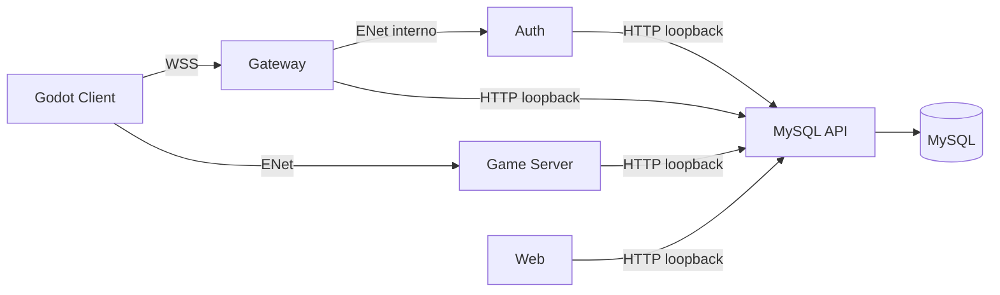
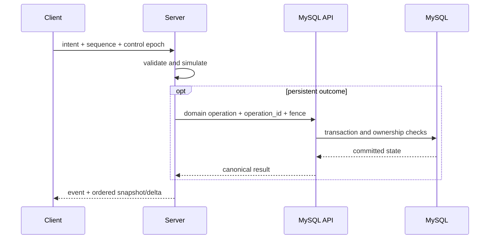

# Arquitetura De Servicos

## Visao Geral

```mermaid
flowchart LR
    C[Godot Client] -->|WSS| G[Gateway]
    G -->|ENet interno| A[Auth]
    A -->|HTTP loopback| API[MySQL API]
    G -->|HTTP loopback| API
    C -->|ENet| S[Game Server]
    S -->|HTTP loopback| API
    W[Web] -->|HTTP loopback| API
    API --> DB[(MySQL)]
```

## Responsabilidades

### Auth

- valida credenciais por operacoes da API;
- aplica politica de autenticacao;
- nao seleciona mapa, personagem ou worker.

### Gateway

- recebe a conexao publica segura;
- valida versao e limita abuso de entrada;
- encaminha autenticacao e seleciona worker disponivel;
- entrega rota e ticket, sem autoridade de gameplay.

### Game Server

- admite a sessao depois do consumo do ticket;
- controla movimento aceito, combate, IA, espacos, Party e dungeon;
- mantem estado quente em memoria;
- persiste somente eventos e checkpoints necessarios pela API.

### MySQL API

- e a unica interface de banco usada pelos outros servicos;
- oferece endpoints de dominio, nao SQL generico;
- valida ownership, fence, idempotencia e transacao;
- retorna estado canonico depois de mutacoes.

### Client

- envia intencao, nunca resultado;
- prediz movimento local e apresenta acoes;
- reconcilia por acknowledgements e snapshots ordenados;
- carrega cenas por `space_id` antes de aplicar o snapshot correspondente.

### Web

- apresenta conteudo publico, conta e suporte;
- nao compartilha credenciais internas com o navegador;
- usa sessao segura e endpoints internos de menor privilegio.

## Fluxo De Gameplay

```mermaid
sequenceDiagram
    participant C as Client
    participant S as Server
    participant P as MySQL API
    participant D as MySQL
    C->>S: intent + sequence + control epoch
    S->>S: validate and simulate
    opt persistent outcome
        S->>P: domain operation + operation_id + fence
        P->>D: transaction and ownership checks
        D-->>P: committed state
        P-->>S: canonical result
    end
    S-->>C: event + ordered snapshot/delta
```

## Handoff E Retomada

- Worker de origem persiste a transicao e emite handoff de uso unico.
- Worker de destino consome o handoff e adquire o lease antes de escrever.
- Retomada curta usa grant separado, vinculado a sessao e worker; o ticket
  original nunca volta a ser valido.
- Party permanece durante handoff e desconexao transitória; offline definitivo
  remove o membro.

## Falhas

- Persistencia recusada nao pode ser apresentada como concluida.
- Ticket invalido, expirado ou consumido falha fechado.
- Worker sem lease perde autoridade de escrita.
- Pedido duplicado retorna resultado idempotente ou conflito explicito.
- Pressao de snapshot pode adiar estado de baixa prioridade, nunca controle,
  HP autoritativo ou despawn confiavel.

## Onde Colocar Uma Funcionalidade

- Regra ou resultado do jogo: Server.
- Estado duravel: endpoint de dominio na MySQL API.
- Credencial: Auth + API.
- Descoberta de worker: Gateway + API.
- Feedback e interacao: Client.
- Conteudo estatico: JSON e cenas no repositorio proprietario.
- Processo operacional: Agent.

Qualquer excecao deve ser registrada em `docs/DECISION_LOG.md`.
