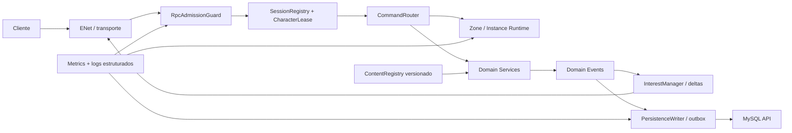

# Review arquitetural do `datamoon-online-server`

> Historical review retained for implementation context. Its deployment command
> examples are superseded by `docs/OPERATIONS.md`, which is the only current VM
> runbook.

Data da revisão: 2026-07-15
Última atualização do plano: 2026-07-18
Branch consolidada atual: `pbe`
Branches P1 antigas: consolidadas em `pbe` e removidas após validação.
Escopo: estrutura de código, coesão, segurança, rede, persistência, gameplay, funcionalidades, operação e escalabilidade para MMORPG.

## 1. Resumo executivo

O servidor tem uma base funcional coerente para beta pequena: o gameplay é majoritariamente autoritativo, há separação da persistência pela MySQL API, conteúdo em JSON, movimento com `tick`/`epoch`, instâncias de dungeon e filtragem espacial de snapshots. O projeto também já demonstra preocupação real com ownership, idempotência e rollback.

Os P0 e os P1-01 a P1-08 foram implementados no escopo funcional acordado nesta branch. Isso não torna a arquitetura pronta para carga de MMORPG: o próximo gate é operacional, com deploy e smoke integrado dos workers de dungeon; capacidade, divisão do overworld e redução adicional de autoloads seguem como evolução posterior. Teste de carga foi adiado explicitamente.

Classificação geral:

| Área | Estado atual | Leitura |
|---|---|---|
| Autoridade de gameplay | Boa base | Dano, colisão, cooldown, recompensa e movimento são resolvidos no servidor. |
| Segurança de entrada | P0 fechado | Admissão, limites, fencing distribuído e ticket curto antirreplay foram aplicados. |
| Consistência econômica | P0 fechado | Fluxos críticos usam operação atômica, idempotente, versionada e auditável na API. |
| Rede e interesse | Em evolução | Chunks e `space_id` existem; snapshots agora usam baseline/delta por entidade, despawn explícito e budget por peer/tick. |
| Coesão/manutenção | Média-baixa | Domínios existem, mas o uso intenso de globais mantém acoplamento alto. |
| Operação e resiliência | Boa base para PBE | Há checkpoint bulk, métricas, backpressure, circuit breaker, graceful drain, registry e handoff durável de dungeon. |
| Prontidão para MMO | Não pronta | Adequada para beta controlada de poucos jogadores, não para escala horizontal. |

## 2. Metodologia e inventário

Foram consultadas as regras canônicas de arquitetura, rede, banco, Godot, combate, economia, quests, dungeons, Link e decisões do projeto em `datamoon-online-agent`.

Inventário observado:

- 94 scripts GDScript;
- aproximadamente 18.063 linhas de GDScript;
- 32 autoloads após remover a conexão Auth ociosa; o inventário original variou durante as branches de features;
- 46 arquivos JSON de conteúdo;
- maiores unidades:
  - `inventory.gd`: 1.156 linhas;
  - `server.gd`: 1.124 linhas;
  - `portal_manager.gd`: 839 linhas;
  - `datamoon_enemy.gd`: 780 linhas;
  - `rpc_surface.gd`: 772 linhas.

Validações executadas:

- import/parse headless com Godot 4.7: sem erro de parse dos scripts;
- boot headless curto do projeto: concluído com código de saída `0` quando o diretório de dados foi redirecionado para uma área gravável;
- sintaxe dos 46 JSONs: válida;
- SHA-256 do `rpc_surface.gd` do cliente e servidor: idêntico no commit revisado;
- cena de regressão P0 `tests/p0_hardening_test.tscn`: aprovada em Godot 4.7, cobrindo handle/lease de lock, ausência de catch-up físico no RPC de combate, limite de pacote, estados/limites de admissão e tentativa única de verificação;
- `go test ./...` aprovado na MySQL API, incluindo separação criptográfica entre token de sessão e game ticket, audiência e detecção de adulteração;
- import/parse headless aprovado em Auth, Gateway e Client após a troca para game handoff ticket;
- pipeline de CI do server e da MySQL API adicionado, com cenas headless, contrato RPC/conteúdo e testes Go.

Limitação atual: os fluxos anteriores foram validados em PBE, mas o novo handoff entre processos ainda requer o smoke coordenado com overworld, dungeon worker, API e client. Não houve carga concorrente, por decisão explícita desta etapa.

## 3. Pontos positivos que devem ser preservados

### 3.1 Autoridade do servidor

O cliente envia intenção e o servidor resolve movimento, cooldown, mana, hitbox, dano, morte e recompensas. O fluxo em `combat.gd`, `datamoon.gd` e `hittbox.gd` segue a direção correta para um jogo competitivo.

### 3.2 Movimento com identidade de sessão

`ControlSession` usa entidade controlada, `control_epoch`, ordem de input e fila limitada. A direção é normalizada antes da aplicação. Esses mecanismos são uma boa base anti-replay e para a alternância Player/Datamoon.

### 3.3 Interesse espacial e isolamento por espaço

`worldstate.gd` já possui índice por chunk, raio de visibilidade e `space_id`. Dungeons usam espaços distintos, reduzindo vazamento de estado entre instâncias.

### 3.4 Persistência atrás de uma API interna

Não há acesso direto ao MySQL no Godot. `InternalApiClient` usa bearer interno, e diversas mutações enviam `user_id`, `character_id`, motivo, ator e `operation_id`. Craft, cooking e hatch usam endpoints específicos, o que é muito melhor do que operações genéricas.

### 3.5 Conteúdo data-driven

Datamoons, skills, itens, receitas, quests, NPCs, objetos, portais, spawns e dungeons são dirigidos por JSON. Essa direção favorece balanceamento e autoria de conteúdo sem branches de código por criatura.

### 3.6 Contrato RPC espelhado

O `rpc_surface.gd` está idêntico entre cliente e servidor no estado revisado, e usa canais/reliability diferentes para movimento e snapshots. Esse contrato deve continuar explícito e automatizado no CI.

### 3.7 Instâncias e cleanup

`portal_manager.gd` mantém membros, tempo limite, status, inimigos e portais por instância; também remove instâncias vazias. A estrutura é válida como primeira versão de dungeon.

## 4. Achados prioritários

Prioridades usadas:

- **P0 — crítico:** corrigir antes de abrir carga pública ou economia relevante;
- **P1 — alto:** necessário para uma beta maior e operação confiável;
- **P2 — médio:** melhoria estrutural ou funcional importante;
- **P3 — baixo:** dívida localizada ou acabamento.

Removidos da fila P0 ativa após implementação e validação nesta branch:

- `P0-01`: movimento autoritativo usa passos fixos; o contexto de combate só pode consumir a janela limitada de reenvio; pacote, fila e avanço de tick possuem limites explícitos;
- `P0-02`: admissão central por estado/categoria, token buckets, limites estruturais/de bytes, tentativa única de verificação, desconexão progressiva e backpressure da API interna;
- `P0-03`: lease durável, arbitragem entre shards e `fencing_token` monotônico revalidado dentro da transação de cada mutação;
- `P0-04`: consumo, grants, quest transition e auditoria em operação idempotente única, com hash, versão de catálogo e snapshot final;
- `P0-05`: checkpoint bulk versionado para personagem e Datamoon, com baixa prioridade, jitter, retry e métricas por minuto;
- `P0-06`: ticket de handoff de 60 segundos com domínio criptográfico separado, `jti`, audiência, nonce e consumo atômico de uso único.

### P1-01 — Concluído: snapshots por baseline, delta e budget

Tratamento aplicado:

- baseline versionada por peer no primeiro envio, em mudança de interesse/metadados e a cada 40 ticks para recuperação;
- lifecycle confiável em `receive_worldstate_baseline` e deltas frequentes em `receive_worldstate` com `unreliable_ordered`;
- versões de entidade funcionam como dirty flags; cada delta contém apenas campos alterados, enquanto metadados estáticos ficam no baseline;
- o cliente materializa baseline + deltas antes de reutilizar o buffer e a interpolação existentes, e rejeita deltas de revisão desconhecida;
- seleção de interesse e deltas respeitam budget bruto de 16 KiB por peer/tick, preservando peer/controlado e degradando entidades mais distantes primeiro;
- métricas cobrem bytes brutos/comprimidos, razão de compressão, build por peer/lote, uso de budget, entidades/campos adiados, baseline/delta, canal confiável e provável fragmentação;
- testes focados cobrem política de campos, metadata-on-spawn, budget/prioridade, canal confiável, materialização no cliente e fencing por revisão.

Limites deliberados: compressão permanece no thread principal e payloads não são compartilhados entre peers porque revisão, controle, dirty set e budget são individuais. Esses custos agora são menores e mensurados; mover compressão para worker só deve ocorrer após perfil de carga demonstrar ganho sem aumentar atraso ou reordenação.

### P1-02 — Concluído no primeiro corte: overworld e dungeons possuem ownership de processo

Tratamento aplicado:

- workers `zone` e `instance` registram heartbeat, capacidade, rota, catálogo e estado `ready/draining` na MySQL API;
- o Gateway seleciona apenas zone worker `ready` e saudável para login/reconnect seguro no overworld;
- entrada em dungeon reserva um instance worker saudável e emite ticket curto, assinado, de uso único e direcionado ao `worker_id` escolhido;
- o overworld persiste posição/Datamoon antes da saída e mantém o lease durável em trânsito, sem permitir dois donos simultâneos;
- o dungeon worker valida o contexto assinado, transfere o lease atomicamente, incrementa o fencing token e confirma `claim -> ack` antes de iniciar gameplay;
- a instância usa `instance_id` durável como `space_id`; instance workers não materializam NPCs, portais, objetos ou spawns do overworld;
- o client troca rota em memória, reconecta e seleciona automaticamente o mesmo personagem;
- handoffs preparados e expirados são cancelados na retomada pelo overworld, permitindo novo lease com fencing maior;
- dungeons locais dentro do overworld continuam disponíveis apenas quando o processo não é `zone`, preservando o runtime de instância sem duplicar ownership.

Limite deliberado: este corte distribui overworld e dungeons. Dividir o próprio overworld em múltiplas zones/chunks permanece evolução de capacidade, condicionada a métricas e não ao gate funcional da Fase 1.

### P1-03 — Concluído: cliente interno com backpressure, circuit breaker e bootstrap de sessão

Tratamento aplicado:

- `InternalApiClient` limita requests em voo, filas normais e filas de checkpoint, com backpressure explícito quando a fila satura;
- requests de checkpoint têm orçamento separado para não competir igualmente com leituras e mutações interativas;
- falhas recuperáveis consecutivas abrem um circuit breaker curto, degradam readiness de `internal_api` e recusam chamadas novas com `internal_api_circuit_open`;
- métricas expõem requests por resultado/prioridade, filas, requests em voo, circuito aberto e falhas consecutivas;
- retries continuam restritos a operações idempotentes com `operation_id`, como reward operations;
- o join passou a consumir o bootstrap existente de `/v1/game/characters/{id}/session` para carregar personagem, Datamoon, inventário, hotbar, efeitos e cooldowns a partir de um mesmo snapshot inicial.

Limite deliberado: o bootstrap usado nesta etapa não agregou todos os domínios opcionais de pós-join. Equipamento, archive, hatch, quests e guild ainda podem evoluir para um bootstrap maior ou para carregamento assíncrono/degradável. O ganho principal desta etapa é tirar o caminho crítico de join da sequência redundante de Datamoon, inventário e hotbar, além de impedir cascata quando a API interna degrada.

### P1-04 — Concluído: logging estruturado e fundação de observabilidade

Tratamento aplicado:

- fila limitada de logs processada fora do thread principal, com descarte prioritário de `DEBUG` sob saturação;
- JSON Lines em stdout e arquivo diário único do servidor, com rotação limitada;
- campos comuns e IDs de correlação promovidos para o nível principal do evento;
- métricas limitadas em memória para tick, entidades, snapshots, tráfego, RPC, locks, API interna, checkpoints e fila de logs;
- endpoints locais `/health`, `/ready` e `/metrics`;
- readiness composta por catálogos carregados, porta ENet, API interna pronta e ausência de drain;
- teste focado, endpoint HTTP local e runbook consolidado neste documento.

Validação pós-deploy:

- branch `feat/p1-observability-foundation` atualizada até `7e38b5c`;
- `godot --headless --import --quit` aprovado na VM após correção de tipagem do `health_server.gd`;
- `datamoon-server.service` iniciou com logs JSON estruturados;
- `observability_endpoint_listening` confirmou bind local em `127.0.0.1:5001`;
- `GET /health`, `GET /ready` e `GET /metrics` responderam corretamente, com readiness `200 OK` e métricas Prometheus `datamoon_*`.

Limite deliberado: validação semântica completa dos catálogos continua no P1-06; o componente de conteúdo deste P1 confirma apenas que a carga inicial terminou. Coleta, retenção e alertas externos também são responsabilidade da infraestrutura, não do game loop. O teste automatizado agora cobre métricas/readiness/logger em memória e o transporte HTTP local de `health_server.gd`.

Runbook operacional:

- endpoint local padrão: `127.0.0.1:5001`;
- `GET /health`: confirma que o processo e o endpoint HTTP estão vivos;
- `GET /ready`: retorna `200` apenas quando catálogos, ENet, API interna e ausência de drain estão saudáveis; caso contrário retorna `503`;
- `GET /metrics`: expõe métricas Prometheus `datamoon_*`;
- variáveis aceitas: `DATAMOON_OBSERVABILITY_HOST`, `DATAMOON_OBSERVABILITY_PORT`, `DATAMOON_LOG_STDOUT`, `DATAMOON_LOG_FILES` e `DATAMOON_LOG_LEVEL`;
- `DATAMOON_LOG_LEVEL` aceita `DEBUG`, `INFO`, `WARN` ou `ERROR`;
- stdout deve permanecer habilitado sob systemd para consulta via `journalctl`;
- se um Prometheus remoto precisar coletar métricas, preferir agente/proxy local; não expor esse bind diretamente na internet.

Comandos de validação:

```bash
curl --fail --silent --show-error http://127.0.0.1:5001/health
curl --include http://127.0.0.1:5001/ready
curl --fail --silent --show-error http://127.0.0.1:5001/metrics | head -n 30
godot --headless --path /opt/datamoon/datamoon-online-server --scene res://tests/p1_observability_test.tscn
```

### P1-05 — `server.gd` e autoloads formam um service locator de alto acoplamento

Evidência:

- `server.gd` possuía 1.693 linhas e misturava transporte, autenticação, inventário, equipamento, hotbar, crafting, cooking, hatch, quests, archive, social, chat, movimento e helpers; após a conclusão do P1-05, está em aproximadamente 772 linhas;
- 27 autoloads podem chamar uns aos outros por nomes globais;
- `functions.gd` já extraiu módulos, mas permanece uma fachada global;
- a conexão ENet ociosa com Auth foi removida; game servers consomem tickets exclusivamente pela MySQL API.

Impacto:

- ciclo de dependências implícito e ordem de autoload sensível;
- testes unitários exigem SceneTree global completo;
- alteração em um domínio aumenta risco em outros;
- responsabilidades de Auth estão duplicadas/ambíguas.

Recomendação:

- tornar `ServerKernel` a composition root;
- dividir `server.gd` em `RpcGateway` e handlers por domínio;
- handlers pequenos recebem dependências explícitas;
- autoloads apenas para composição realmente global, não para cada feature;
- escolher uma fronteira de token: Auth valida ou API valida, removendo a conexão ociosa;
- refatorar incrementalmente, mantendo o `rpc_surface.gd` estável.

Tratamento aplicado nesta etapa:

- `server_social_handlers.gd`: concentra chat, party e guild;
- `server_lobby_handlers.gd`: concentra lobby, seleção, criação, exclusão e listagem de personagens;
- `server_inventory_handlers.gd`: concentra inventário, equipamento, hotbar, craft e cooking;
- `server_activity_handlers.gd`: concentra archive, hatch, quests, interação com NPC e portal;
- `server_loading_handlers.gd`: concentra o estado e as transições do handshake `LOADING -> IN_GAME`, incluindo expiração e métricas;
- `server_operation_diagnostics.gd`: concentra a validação e observabilidade dos diagnósticos pós-operação enviados pelo client;
- `server_hotbar_runtime.gd`: concentra cache, dirty state, normalização, resolução e persistência da hotbar, sem expor seus dicionários aos demais módulos;
- `server_inventory_replication.gd`: concentra revisão, baseline/delta e estado de replicação do inventário por peer;
- `server_activity_runtime.gd`: concentra rollback do archive, regras de bloqueio, normalização e snapshots de archive, hatch e quests;
- `_initialize_runtime_components()` tornou explícita em `server.gd` a composição dos handlers de runtime;
- `server.gd` preserva os métodos RPC públicos como wrappers finos, mantendo nomes, assinaturas e `rpc_surface.gd` intactos;
- a validação de peer, admission/rate-limit, locks de personagem/guild e chamadas autoritativas foram preservadas nos mesmos pontos lógicos;
- rollback e snapshots foram movidos sem alterar a ordem de stage/restore/discard, persistência, mensagens localizadas ou refresh autoritativo do Datamoon.

Status: implementação e smoke do P1-05 concluídos no escopo da Fase 1. Login/loading, archive, hatch, craft/cooking, movimento/skill, troca por TAB e a extração final de archive/snapshots foram validados em PBE sem hard snaps candidatos. Handlers, estados de hotbar/replicação e runtime de activity são compostos explicitamente em `server.gd`. A conexão global ociosa com Auth também foi removida; a substituição integral dos autoloads restantes continua como redução incremental, não como bloqueio da Fase 1.

#### P1-05A — Recuperação da sequência de movimento após ações persistentes

Diagnóstico confirmado em PBE:

- craft, cooking, hatch e archive expuseram um estado em que o cliente continuava produzindo `input_tick`, enquanto o servidor permanecia em um `last_processed_input_tick` antigo;
- a proteção `MAX_INPUT_TICK_LEAD=24` rejeitava corretamente o salto, mas não existia transição de recuperação; o cliente continuava avançando e todos os comandos seguintes permaneciam inválidos;
- em uma ocorrência real, o servidor ficou no tick `28` enquanto o cliente avançou de `114` até pelo menos `348`;
- métricas descartaram pausa global como causa: physics delta permaneceu em `16,67 ms`, processamento de movimento ficou abaixo de `0,35 ms` no p99 e a API interna ficou abaixo de aproximadamente `65 ms` no p99;
- o snap era consequência da previsão local continuar sobre uma sequência que o servidor já não aceitava, e não de posição persistida incorretamente no banco.
- o primeiro teste da recuperação encontrou um segundo caso: diferença de `25` ticks com `22` comandos pendentes ainda era backlog válido. Rotacionar epoch nessa condição interrompeu a animação da Skill 1; portanto, recuperação não pode ser disparada no limite normal da fila nem durante uma ação que já suprimiu movimento.
- o teste seguinte registrou pico transitório de aproximadamente `300 ms` e uma lacuna real de `61` ticks (`392 -> 453`) sem comandos pendentes. Como tick ordena input e não concede distância/catch-up, a janela de recuperação pode cobrir essa oscilação sem reduzir a autoridade do servidor;
- ataque/skill ainda iniciaram `1` e `4` ticks antes do movimento solicitado. O cliente podia terminar seu timer visual antes de receber o snapshot autoritativo de fim, avançando a sequência enquanto prediction ainda recusava comandos no estado `attack/skill`.

Processo de correção seguro, em etapas:

1. **Recuperação genérica da sequência:** quando um pacote bem formado, da entidade e epoch atuais, excede a janela temporal, o servidor não simula nem confirma o comando. Ele rotaciona o `control_epoch`, zera apenas a sequência de inputs, limpa pendências e congela velocidade residual. O snapshot existente comunica a nova geração e o cliente já reinicia prediction/histórico ao observar a mudança.
2. **Proteção e observabilidade:** uma recuperação tem cooldown por peer, gera um único log estruturado e incrementa `movement_input_sequence_resync_total`; pacotes do epoch anterior passam a ser ignorados sem flood de warnings.
3. **Boundary explícito de ações:** após validar a recuperação genérica, archive/hatch/craft/cooking devem publicar início/fim de operação quando houver lock visual ou de movimento. Timers independentes de cliente e servidor não devem decidir sozinhos quando retomar input.
4. **Redução de trabalho redundante:** remover refresh duplicado de inventário após hatch e medir duração end-to-end por tipo de ação antes de mover qualquer trabalho para thread/worker.
5. **Evolução do combate:** substituir futuramente o flush síncrono do contexto de combate por agendamento da ação para um tick autoritativo já processado, preservando responsividade visual no cliente e impedindo catch-up dentro do RPC.
6. **Teste adversarial:** validar perda/burst de pacotes, freeze do cliente, ação durante movimento, dois peers simultâneos e repetição maliciosa de tick alto. Um peer em recuperação não pode alterar posição, tick ou latência dos demais.

Critérios de aceite da primeira etapa:

- nenhum peer permanece indefinidamente em `movement_input_rejected_outside_tick_window`;
- o primeiro salto inválido gera exatamente uma rotação de epoch, sem aplicar deslocamento do comando rejeitado;
- o cliente retoma comandos no novo epoch pelo snapshot normal, sem reconnect ou TAB;
- no máximo uma correção visual autoritativa ocorre; não há cadeia de snaps;
- skill, ataque e troca de controle continuam funcionando com a mesma autoridade;
- métricas de physics tick e dos demais peers não pioram durante a recuperação.

Status da implementação: etapa 1 iniciada na branch `feat/p1-05-server-modularization`, reutilizando o `control_epoch` e o envelope de snapshot existentes, sem mudança de RPC, banco ou contrato de persistência. Após os testes PBE, a janela foi elevada de `40` para `120` ticks para absorver até dois segundos de lacuna de transporte sem catch-up físico: cada physics tick ainda consome no máximo um comando. Inputs recebidos enquanto o Datamoon está em ataque/skill são confirmados de forma limitada sem simular movimento e sem rotacionar epoch. No cliente, o `input_tick` agora permanece congelado até o snapshot autoritativo encerrar `attack/skill`, impedindo janelas vazias entre o timer visual e o estado real. A carga síncrona da primeira cena de um Datamoon segue como hipótese separada para picos de ping em archive e deve ser medida antes de migrar preload para thread. As etapas 3 a 6 permanecem condicionadas à validação desta entrega refinada.

### P1-06 — Concluído: conteúdo possui validação semântica e fail-fast

Tratamento aplicado:

- arquivos/diretórios ausentes, JSON inválido, root incorreto, catálogo obrigatório vazio, ID ausente e ID duplicado impedem readiness verde;
- validação cruzada cobre Datamoons, stats, cenas pet/enemy, character options, items/stacks, hatch, rewards, recipes, quests/dependências/objetivos, NPCs/services, fishing rewards, enemy spawns, world objects/scenes, portais e dungeons;
- referências de item, Datamoon, quest, NPC, dungeon e cena são verificadas no boot;
- SHA-256 determinístico de todos os JSONs é exposto no readiness, heartbeat e operações econômicas junto de `catalog_version`;
- `tests/p1_contract_test.tscn` e `tests/p1_observability_test.tscn` bloqueiam conteúdo semanticamente inválido.

### P1-07 — Concluído no escopo da Fase 1: drain e recuperação de handoff

Tratamento aplicado:

- shutdown marca worker `draining`; readiness cai e o Gateway deixa de selecioná-lo porque consulta apenas workers `ready` e saudáveis;
- peers em drain não iniciam novas operações, dirty state/hotbar e checkpoints são finalizados antes da liberação do lease;
- handoff mantém estado durável `prepared -> claimed -> active`, vinculado a personagem, source/target worker, instância e fencing;
- falha antes do `claim` não transfere ownership; após expiração, reconnect no overworld cancela a reserva e toma novo lease com fencing maior;
- falha após `claim` não reativa o source: o target é o único lease válido e o lease expira normalmente se o processo cair;
- rewards continuam reconciliáveis por `operation_id`, e posição persistida antes da transferência mantém o overworld como fallback seguro.

Limite deliberado: party social persistente e retomada da mesma dungeon após crash total do instance worker não fazem parte deste corte; o comportamento seguro é terminar a sessão transitória e retornar ao overworld, sem duplicar reward ou ownership.

### P1-08 — Concluído no escopo acordado: gates de contrato, conteúdo e regressão

Tratamento aplicado:

- workflow do server executa as cenas P0/P1 headless e import em CI;
- workflow da MySQL API executa `go test ./...`;
- hash golden bloqueia alteração unilateral ou reordenação acidental de `rpc_surface.gd`;
- gate confere nomes RPC críticos, rotas da API, budget de autoloads, ausência da conexão Auth obsoleta, hash e validação semântica de conteúdo;
- testes Go cobrem ticket direcionado com contexto assinado, proteção de audiência/tamper e validação de identificadores do handoff;
- `tools/run_quality_gates.ps1` fornece a mesma bateria para Windows local.

Teste de carga foi explicitamente adiado por decisão de produto nesta etapa. Ele permanece como calibração futura de capacidade, não como pendência funcional escondida do P1-08.

### P2-01 — IA faz busca global de alvos e não usa índice espacial

Evidência:

- cada inimigo percebe a cada 0,25 s;
- `_scan_for_target()` percorre todos os Datamoons em `functions.datamoon_map` (`datamoon_enemy.gd:260-276`).

Impacto: custo aproximado `inimigos × Datamoons` e piora rápida em zonas densas.

Recomendação: consulta ao índice espacial/interest manager por `space_id` e células próximas; escalonar percepção por budget e distância; desativar IA longe de jogadores.

### P2-02 — Projéteis não têm lifecycle e deduplicação de hit explícitos

Evidência:

- `projectile.gd` apenas move o nó e não define TTL, alcance, colisão de mundo, destruição ao hit ou conjunto de alvos atingidos;
- a cena base de projétil não contém hitbox;
- `hittbox.gd` aplica dano em `area_entered` sem `action_id`/deduplicação por alvo.

Impacto: ao ativar projéteis em conteúdo futuro, há risco de leak, projétil infinito e hits repetidos/reentrantes.

Recomendação: `ProjectileSpec` com TTL, alcance, pierce count, collision mask, `action_id`, `hit_targets` e cleanup garantido; teste de no máximo um hit por alvo quando a skill assim definir.

### P2-03 — Social/chat precisa de moderação e proteção operacional

Evidência:

- world chat é broadcast global (`server.gd:119-120`);
- não há limite de comprimento, frequência, mute, canais por zona, denúncia ou permissões de staff;
- blacklist faz substituição textual simples.

Impacto: spam global, amplificação de banda, abuso textual e custo de moderação.

Recomendação: limites por canal, cooldown/token bucket, canais por zona/idioma, mute/ban, audit log, ferramentas GM e política de retenção. Sanitização visual não substitui moderação.

### P2-04 — Party não possui grace de reconexão; lookups sociais percorrem players

Evidência:

- party é removida no disconnect;
- lookup por nickname percorre filhos de `player_map` em party/guild;
- não há índice central `character_id`, nickname normalizado e session id.

Recomendação: `OnlineCharacterIndex` O(1), convite com expiração explícita e reconnection grace curto; party continua transitória, mas com política clara para dungeon e liderança.

### P2-05 — Handshake de compatibilidade é apenas uma string de versão

Evidência:

- `config.is_client_version_supported()` compara igualdade textual;
- contrato RPC exige ordem idêntica, mas não há gate automático no servidor;
- `rpc_contracts.gd` de cliente e servidor já divergem em constantes auxiliares, embora o `rpc_surface.gd` esteja igual.

Recomendação: handshake com `protocol_version`, `content_version`, `build`, feature flags e motivo de incompatibilidade; CI deve comparar o contrato espelhado e impedir merge unilateral.

### P2-06 — Gaps funcionais em relação aos pilares do projeto

Observações:

- alternância de controle existe, mas o humano hoje é principalmente movimento, follow e pesca; não há conjunto tático claro de combate no `Player`;
- o comando de combate sempre aciona o Datamoon, independentemente da entidade controlada;
- não foi encontrado sistema de captura/taming de inimigos selvagens, apesar de Monster Taming ser o núcleo;
- a decisão de evolução v1 está documentada no Decision Log, mas não foi encontrada implementação de unlock/transform/regressão;
- não foram encontrados PvP, trade/market, mail, ferramentas GM ou moderação — aceitável para beta, mas precisam de roadmap explícito.

Recomendação de produto/arquitetura:

1. priorizar captura, evolução e papel tático do humano antes de expandir sistemas periféricos;
2. modelar cada ação como comando autoritativo da entidade atualmente controlada;
3. separar `HumanAbilityService` e `DatamoonAbilityService`, compartilhando validação de combate;
4. registrar unlocks de evolução por `datamoon_id` e manter forma ativa apenas em runtime, conforme decisão aceita;
5. incluir cada nova faucet/sink no ledger econômico e testes de abuso.

### P3-01 — Nomes e tipos ainda são inconsistentes

Exemplos: `Hittbox` em vez de `Hitbox`, `get_Idle_state`, parâmetros sem tipo em handlers e dicionários com acesso por propriedade (`row.id`). Não impede o boot atual, mas reduz clareza e segurança de refatoração.

Recomendação: formatter/linter, tipagem gradual nas fronteiras, DTOs/normalizadores para payloads e nomenclatura única. Mudanças em nomes RPC devem respeitar o contrato espelhado.

## 5. Arquitetura-alvo recomendada

Uma evolução incremental, preservando Godot e a MySQL API:



Responsabilidades sugeridas:

| Componente | Responsabilidade |
|---|---|
| `RpcAdmissionGuard` | Estado de sessão, schema, tamanho, rate limit e abuse score. |
| `SessionRegistry` | `session_id`, peer, user, character, epoch, lease e operações em voo. |
| `CommandRouter` | Encaminhar comandos tipados; nenhum domínio lê `remote_sender_id` diretamente. |
| `ZoneRuntime` | Tick fixo, entidades, colisão, IA e ownership espacial. |
| `InstanceRuntime` | Dungeon isolada com lifecycle, budget e resultado idempotente. |
| `CombatService` | Validar/produzir ações, hits, status, morte e eventos de reward. |
| `EconomyService` | Orquestrar somente operações atômicas e auditáveis da API. |
| `PersistenceWriter` | Dirty sets, batch, prioridade, retry idempotente, checkpoint e drain. |
| `InterestManager` | Baselines, deltas, spawn/despawn e orçamento por peer. |
| `ContentRegistry` | Schema, referências, hash, versão e acesso somente leitura. |
| `Observability` | Logs, métricas, tracing/correlation e health/readiness. |

Regra central: handlers RPC validam envelope e identidade, serviços de domínio validam regras de gameplay, e a MySQL API revalida ownership/transação. Nenhuma dessas camadas substitui a outra.

## 6. Plano de melhoria incremental

### Fase 0 — Concluída nesta branch

Fencing durável, rewards atômicos/idempotentes, checkpoint bulk prioritário e game ticket de uso único foram implementados. A regressão local cobre os invariantes de processo e ticket; testes integrados com MySQL real, concorrência entre dois shards e falha após commit permanecem como gate operacional antes de carga pública.

### Fase 1 — Modularidade, resiliência e observabilidade

Status atual: P1-01 a P1-08 estão implementados no escopo funcional acordado da Fase 1. O P1-05 teve smoke PBE concluído; P1-02/P1-07 agora possuem handoff durável de dungeon e recovery seguro; P1-06 possui validação semântica fail-fast; P1-08 possui gates locais/CI. Teste de carga e divisão do próprio overworld foram adiados para a fase de capacidade.

Próximo gate operacional:

1. atualizar API antes dos game workers para aplicar a migration `018`;
2. subir overworld e ao menos um dungeon worker com portas/host alcançáveis pelo client;
3. validar entrada, gameplay, saída e reconnect de dungeon com um cliente;
4. repetir com party de dois clientes;
5. após o smoke, seguir para itens P2; carga permanece adiada.

### Fase 2 — Capacidade MMO

1. testes com bots headless e metas de capacidade por zone;
2. zones/shards com ownership explícito;
3. workers separados para dungeons quando necessário;
4. handoff de sessão entre zones;
5. reconnect grace e recuperação de instância;
6. proteção de economia com ledger/outbox e reconciliação automática;
7. ferramentas GM, moderação e painéis operacionais.

### Fase 3 — Pilares de gameplay

1. captura/taming autoritativo;
2. evolução v1 conforme Decision Log;
3. ações táticas do humano que justifiquem dual control;
4. telegraphs e lifecycle robusto de projéteis/skills;
5. PvP somente após autoridade, lag handling e anti-abuse estarem medidos;
6. trade/market somente após ledger econômico e idempotência estarem maduros.

## 7. Métricas e critérios de aceite

Antes de aumentar `max_clients`, estabelecer metas por zone:

- `server_tick_ms` p50/p95/p99;
- ticks atrasados e maior atraso contínuo;
- entidades ativas e com IA por zone/instância;
- bytes enviados/recebidos por peer e total;
- tempo de build/compressão de snapshots;
- tamanho e idade das filas de comandos e persistência;
- RPCs aceitas, rejeitadas e rate-limited por categoria;
- requests da API em voo, latência, timeout, circuit breaker e resultado desconhecido;
- writes persistentes por jogador/minuto;
- locks ativos, tempo de espera e liberações inválidas;
- reward operations iniciadas, commitadas, repetidas e reconciliadas;
- memória por entidade, dungeon e sessão.

Testes de capacidade devem provar:

1. movimento nunca excede o deslocamento permitido;
2. um cliente hostil não degrada o tick dos demais;
3. timeout após commit não duplica reward;
4. reconnect não permite duas sessões mutando o mesmo personagem;
5. restart não perde reward confirmado nem aceita replay;
6. API indisponível degrada features persistentes sem derrubar simulação e movimento;
7. snapshot respeita budget sob alta densidade;
8. conteúdo inválido impede readiness.
9. perda de sincronismo de input rotaciona a sequência uma vez e recupera movimento sem reconnect, TAB ou aceitação de posição do cliente.

## 8. Ordem recomendada de refatoração de arquivos

| Ordem | Arquivos atuais | Extração sugerida |
|---|---|---|
| 1 | `movement_authority.gd`, `control_session.gd` | Fixed-step input buffer + validação temporal. |
| 2 | `server.gd`, `rpc_surface.gd` | Admission guard e handlers por domínio, sem alterar o espelho RPC inicialmente. |
| 3 | `character_lock.gd`, `verification.gd`, `functions_session.gd` | Session registry, lease e fencing. |
| 4 | `quests.gd`, `inventory.gd`, rewards de combat/dungeon/fishing | Operações econômicas atômicas e outbox. |
| 5 | `functions.gd`, `skill.gd`, `buff_manager.gd` | Dirty checkpoint/batch persistence. |
| 6 | `worldstate.gd`, `worldmap.gd` | Baseline, delta, prioridade e budget. |
| 7 | `http_json_client.gd`, `database_api.gd` | Persistence client resiliente e bootstrap. |
| 8 | `structured_logger.gd`, `observability.gd`, `health_server.gd` | Fila assíncrona, stdout estruturado, métricas, readiness e endpoint local. |
| 9 | `jsons.gd` | Schemas, referências, hash e fail-fast. |
| 10 | `datamoon_enemy.gd`, `enemy_spawner.gd` | Spatial query, activation e budget de IA. |

## 9. Conclusão

A base demonstra boas decisões para um protótipo online autoritativo, especialmente no uso da MySQL API, conteúdo data-driven, contratos RPC e interesse por chunks/espaços. O principal risco é confundir essas boas fundações com prontidão para MMO.

Com os P0 e P1-01 a P1-08 retirados da fila funcional, o próximo gate é o deploy coordenado e smoke do handoff de dungeon entre processos. Após essa validação, o roadmap pode avançar para P2; calibração de carga, divisão do overworld e substituição adicional de autoloads permanecem evoluções de capacidade/manutenção.

O melhor caminho é incremental: manter o protocolo atual estável, colocar guardas e contratos ao redor dele, extrair domínios um a um e medir cada etapa.

## 10. Fluxo de branches e reconciliação PBE

`pbe` é o passo de validação antes de `main`. Ele deve receber correções e funcionalidades prontas para teste integrado, mas não deve ser usado como branch de desenvolvimento contínuo. O fluxo recomendado é:

1. criar branches novas sempre a partir do `pbe` atualizado;
2. usar `feat/p1-xx-nome-curto` para trabalho P1 e `fix/p0-xx-nome-curto` para correções críticas;
3. abrir/validar a mudança na branch própria;
4. reconciliar com `pbe` usando merge explícito quando a mudança estiver pronta para validação;
5. remover branch local/remota somente depois de confirmar que ela está contida em `pbe`;
6. promover `pbe` para `main` apenas após validação de funcionamento.

Reconciliação atual:

- `feat/p1-01-snapshot-delta` foi reconciliada em `pbe` nos repositórios que continham essa branch: `datamoon-online-server` e `datamoon-online-client`;
- os demais repositórios não tinham branch P1-01 ativa para merge;
- o protocolo preservado foi o de baseline confiável, revisão por peer, delta por campo e budget bruto de 16 KiB por peer/tick;
- documentos paralelos foram descartados em favor deste documento principal.

Comando seguro para manter um repositório de servidor sincronizado com o remoto:

```bash
cd /opt/datamoon/NOME_DO_REPO
git fetch --prune origin
git switch pbe
git pull --ff-only
git remote prune origin
git branch --merged pbe
```

Branches listadas por `git branch --merged pbe` podem ser removidas localmente quando não forem `main`, `pbe` ou a branch ativa. Para remover uma branch remota já mesclada:

```bash
git push origin --delete NOME_DA_BRANCH
```

## 11. Runbook de validação headless e Godot no servidor

Quando uma cena de teste inicia autoloads do servidor, ela pode tentar abrir as mesmas portas do serviço real. Para evitar falso erro de `Couldn't create an ENet host`, `game_server_failed_to_listen` ou `observability_endpoint_failed_to_listen`, pare o serviço antes do teste e reinicie depois.

Validação segura de branch no servidor:

```bash
sudo systemctl stop datamoon-server

cd /opt/datamoon/datamoon-online-server
godot --headless --import --quit
godot --headless --path /opt/datamoon/datamoon-online-server --scene res://tests/p0_hardening_test.tscn

sudo systemctl restart datamoon-server
sleep 3
sudo systemctl status datamoon-server --no-pager
```

Confirmação pós-restart:

```bash
journalctl -u datamoon-server --since "2 minutes ago" --no-pager \
  | grep -Ei "server_started|observability_endpoint_listening|failed|error|connected_to_auth"
```

O resultado esperado é ver `server_started`, `observability_endpoint_listening` e `connected_to_auth` sem novos `failed`/`error` após o restart. Warnings gerados dentro dos testes P0, como stale lock, stale lease, admission rejected e movimento de combate antes do tick solicitado, são cenários negativos intencionais do teste.

Atualização do Godot headless para 4.7.1 stable no servidor:

```bash
cd /tmp
wget -O Godot_v4.7.1-stable_linux.x86_64.zip \
  https://github.com/godotengine/godot-builds/releases/download/4.7.1-stable/Godot_v4.7.1-stable_linux.x86_64.zip

unzip -o Godot_v4.7.1-stable_linux.x86_64.zip
sudo install -m 0755 Godot_v4.7.1-stable_linux.x86_64 /usr/local/bin/godot

godot --version
```

Antes de trocar o binário em produção, prefira parar o serviço:

```bash
sudo systemctl stop datamoon-server
sudo install -m 0755 /tmp/Godot_v4.7.1-stable_linux.x86_64 /usr/local/bin/godot
godot --version
sudo systemctl restart datamoon-server
sudo systemctl status datamoon-server --no-pager
```

## 12. Decisão P1 — workers, registry via API e threads Godot

Decisão arquitetural: preparar o servidor para workers de MMORPG usando o mesmo código-base `datamoon-online-server`, inicialmente dentro de uma única VM, sem Kubernetes. A arquitetura deve continuar compatível com a futura separação em três VMs:

- VM edge/session: `datamoon-gateway` e `datamoon-auth`;
- VM persistence: `datamoon-api` e MySQL ou conexão com banco gerenciado;
- VM gameplay: múltiplas instâncias `datamoon-server@...` para overworld e dungeons.

Enquanto houver poucos jogadores, a operação permanece em uma VM. O desenho futuro deve ser habilitado por configuração, API registry e systemd templates, não por múltiplos repositórios ou binários diferentes.

### 12.1 Modelo de worker escolhido

Cada worker é um processo Godot separado rodando o mesmo projeto, com variáveis de ambiente diferentes:

```text
datamoon-server@overworld
datamoon-server@dungeon-1
datamoon-server@dungeon-2
```

Exemplo de configuração:

```text
DATAMOON_WORKER_ID=overworld-01
DATAMOON_WORKER_KIND=zone
DATAMOON_ZONE_ID=overworld
DATAMOON_GAME_SERVER_PORT=5000
DATAMOON_OBSERVABILITY_PORT=5001
```

```text
DATAMOON_WORKER_ID=dungeon-01
DATAMOON_WORKER_KIND=instance
DATAMOON_INSTANCE_GROUP=dungeons
DATAMOON_GAME_SERVER_PORT=5010
DATAMOON_OBSERVABILITY_PORT=5011
```

Portas reservadas:

| Worker | ENet | Observability |
|---|---:|---:|
| `overworld-01` | 5000 | 5001 |
| `dungeon-01` | 5010 | 5011 |
| `dungeon-02` | 5020 | 5021 |
| `dungeon-03` futuro | 5030 | 5031 |

O padrão é uma porta ENet para gameplay e a porta seguinte para health/readiness/metrics. Gateway, Auth e API continuam usando seus próprios binds: Gateway em 5100, Auth em 5200/5300 e MySQL API em 3000.

### 12.2 Registry via MySQL API

Decisão: implementar o registry de workers via `datamoon-online-mysqlapi` desde o início, mesmo que a primeira versão use configuração estática por trás. Isso evita acoplar Gateway e Game Server a arquivos locais quando a arquitetura migrar para VMs separadas.

Endpoints desejados para P1-02:

```text
GET  /v1/game/workers
POST /v1/game/workers/heartbeat
POST /v1/game/workers/drain
POST /v1/game/instances/reserve
GET  /v1/game/instances/{instance_id}
```

Modelo lógico mínimo:

```json
{
  "worker_id": "dungeon-01",
  "kind": "instance",
  "host": "PUBLIC_OR_PRIVATE_HOST",
  "enet_port": 5010,
  "observability_port": 5011,
  "zone_id": "",
  "instance_group": "dungeons",
  "draining": false,
  "capacity": 40,
  "active_sessions": 0,
  "last_heartbeat_at": "2026-07-16T00:00:00Z"
}
```

Fluxo inicial:

1. cada worker inicia com env próprio;
2. cada worker registra heartbeat na API;
3. Gateway consulta a API para descobrir workers disponíveis;
4. enquanto P1-02 não estiver completo, Gateway sempre escolhe `overworld-01`;
5. quando dungeon worker estiver pronto, Gateway/API podem reservar uma instância e emitir ticket de handoff para o worker correto.

### 12.3 Systemd templates e envs

Decisão operacional: pull de Git continua manual. Start/restart de workers deve ser controlado por systemd templates e env files.

Arquivos alvo:

```text
/etc/systemd/system/datamoon-server@.service
/opt/datamoon/env/datamoon-server-overworld.env
/opt/datamoon/env/datamoon-server-dungeon-1.env
/opt/datamoon/env/datamoon-server-dungeon-2.env
```

Comandos desejados:

```bash
sudo systemctl start datamoon-server@overworld datamoon-server@dungeon-1 datamoon-server@dungeon-2
sudo systemctl restart datamoon-server@overworld datamoon-server@dungeon-1 datamoon-server@dungeon-2
sudo systemctl status datamoon-server@overworld datamoon-server@dungeon-1 datamoon-server@dungeon-2 --no-pager
```

Workers habilitados com `enable` sobem automaticamente no boot. Durante a fase inicial, é aceitável habilitar apenas `datamoon-server@overworld` e manter dungeons manuais até o roteamento estar pronto.

O serviço antigo `datamoon-server.service` pode continuar existindo enquanto P1-02 não for aplicado. Depois, ele deve virar alias operacional para `datamoon-server@overworld` ou ser aposentado em favor do template.

### 12.4 Gateway sempre roteando para overworld no início

Decisão de curto prazo: Gateway sempre manda login/reconnect para `overworld-01`, mesmo que no futuro o jogador tenha desconectado dentro de uma dungeon.

Risco: se o jogador desconectar durante carregamento ou handoff para dungeon, ele pode voltar para overworld e perder estado transitório da instância. Isso é aceitável temporariamente para PBE, desde que:

- rewards confirmados continuem idempotentes e persistidos;
- o character lease/fencing impeça duas sessões mutando o mesmo personagem;
- a entrada em dungeon ainda não confirme recompensa antes da conclusão real;
- o overworld trate reconexão como estado seguro padrão;
- logs indiquem abandono/handoff incompleto.

Quando P1-02/P1-07 avançarem, o comportamento correto será:

1. API registra `character_id -> current_worker_id/current_instance_id`;
2. Gateway consulta esse estado no reconnect;
3. se a instância ainda existir e aceitar reconnect, Gateway manda o jogador para o dungeon worker;
4. se a instância expirou, está drenando ou falhou, Gateway manda para overworld com compensação/reconciliação;
5. handoff deve ter ticket curto, uso único e lease/fencing revalidado no worker destino.

Esse desenho evita dependência direta entre workers no começo. Overworld, dungeon workers e Gateway coordenam via API registry, tickets e fencing.

### 12.5 Comunicação entre workers

Primeira versão: workers não conversam diretamente entre si. Coordenação passa pela MySQL API:

```text
overworld worker -> MySQL API -> registry/instance reservation
Gateway/Auth -> MySQL API -> worker selection/ticket
dungeon worker -> MySQL API -> consume ticket/session ownership
```

Comunicação direta worker-to-worker só deve ser adicionada se houver necessidade clara, como eventos globais de mundo ou handoff sem reconnect. Enquanto isso, a regra é preservar ownership: cada worker é autoridade apenas sobre sua zone/instance.

### 12.6 Threads Godot

Decisão técnica: usar threads Godot apenas para tarefas de dados puros e custo alto, não como modelo principal de workers.

Bom uso de threads:

- carregamento/validação de catálogos no boot;
- preparação de índices de conteúdo;
- compressão/serialização de payloads quando métricas indicarem gargalo;
- pathfinding ou decisões de IA em lote;
- preparação de dados de snapshot;
- geração procedural ou pré-cálculos que não tocam `SceneTree`.

Regra obrigatória:

```text
Thread calcula dados.
Main thread aplica no mundo, nodes, autoloads e RPCs.
```

Evitar em threads:

- criar/remover/manipular Nodes diretamente;
- alterar `SceneTree`;
- mutar autoloads globais sem fronteira clara;
- executar regra autoritativa de combate/persistência fora do fluxo principal sem ownership explícito.

Todo novo processo/funcionalidade P1+ deve avaliar se há carga de dados que pode ser preparada em thread, mas só deve implementar thread quando houver benefício mensurável ou isolamento claro. Threads são otimização local de cada worker; workers/processos continuam sendo a estratégia de escala e isolamento.

## 13. Execução P1 — fluidez, operações e primeiro corte de workers

Status em `pbe`: implementação concluída e validada em gameplay integrada. Esta seção substitui, para o estado atual da branch, os trechos anteriores que descrevem registry, handshake e filas apenas como intenção.

### 13.1 Ciclo autoritativo de combate

O ciclo de ataque/skill passou a ter início e término confiáveis. `combat_action_started` mantém animação e âncora visual; `combat_action_finished` informa `action_id`, entidade, `control_epoch`, posição final, tick reconhecido e motivo. O cliente libera a âncora pela confirmação do servidor e mantém timeout de um segundo apenas como recuperação de perda/desconexão lógica.

Consequências esperadas:

- ataque/skill não depende mais de um futuro delta `idle` não confiável para devolver o controle;
- um delta perdido não mantém o input preso até o baseline periódico;
- a correção pós-animação é suavizada e medida, sem transformar posição prevista em autoridade;
- TAB deixa de ser mecanismo acidental de recuperação do ciclo de combate.

### 13.2 `PlayerOperationCoordinator` e locks de domínio

O mutex amplo continua apenas para fluxos legados/sessão. Operações interativas foram movidas para três domínios explícitos:

| Domínio | Operações atuais | Relação com combate |
|---|---|---|
| `economy` | inventário, equipamento, hotbar, craft e cooking | não bloqueia combate enquanto aguarda API |
| `activity` | hatch, quests, NPC e archive | só `archive_swap` bloqueia combate, pois substitui a entidade ativa |
| `persistence` | checkpoints periódicos | independente de economy/activity e protegido no drain |

O coordenador preserva FIFO apenas entre operações conflitantes, possui handles contra release obsoleto e impede novas operações quando o peer entra em drain. Métricas novas:

No archive, movimento continua autoritativo durante os awaits de persistência; a posição de handoff só é capturada depois da confirmação da API, imediatamente antes de substituir o Datamoon. Novos comandos são então reconhecidos/suprimidos durante a troca curta. Isso elimina a reutilização de uma posição capturada vários awaits antes, que produzia snap grande ao sair da janela.

- `player_operation_queue_wait_duration_ms`;
- `player_operation_duration_ms`;
- `player_operation_e2e_duration_ms` para craft, cooking, hatch e archive;
- `player_operations_active`, `player_operations_queued`, `player_operations_started_total` e `player_operations_finished_total`;
- `internal_api_request_duration_ms` agora inclui rota normalizada e resultado, sem IDs de alta cardinalidade.

### 13.3 Replicação incremental de inventário e catálogos

O primeiro inventário recebido é baseline versionada. Atualizações seguintes enviam apenas `upserts` e `removed_slots`, vinculados por `base_revision -> revision`. Divergência pede uma baseline explícita. A janela do inventário atualiza somente os slots alterados; demais consumidores continuam recebendo `items_changed` para recalcular regras dependentes.

Catálogos de craft/cooking continuam baseline no join porque são pequenos e estáticos por sessão; alterações individuais usam os RPCs de upsert já existentes. Não há reconstrução/reenvio de catálogo a cada craft.

Métricas: `inventory_replication_total` e `inventory_replication_items`, separadas por `baseline`/`delta`.

### 13.4 Preload em background

Cliente e servidor agora possuem `ThreadedResourcePreloader`, baseado em `ResourceLoader.load_threaded_request`. No cliente ele antecipa cenas de Datamoons/objetos, sprites e ícones; no servidor antecipa cenas dinâmicas de Datamoons e objetos. O `ResourceCache` consome o resultado pronto antes de recorrer ao caminho síncrono seguro.

Threads não recebem autoridade de gameplay: apenas carregam/preparam `Resource`. Instanciar cenas, mutar Nodes, aplicar estado e enviar RPC continuam na main thread. O fallback síncrono permanece para conteúdo novo que ainda não esteja no manifesto/preload, evitando despawn ou entidade ausente.

### 13.5 Handshake `LOADING -> CLIENT_READY -> IN_GAME`

O peer passa pelos estados:

```text
VERIFIED -> LOADING -> CLIENT_READY validado -> IN_GAME
```

Durante `LOADING`, apenas RPCs de sistema são aceitos; movimento, combate, economia, chat e social são recusados. O servidor só envia o desafio final após concluir o bootstrap. O cliente responde quando player, HUDs, hotbar, primeiro worldstate e recursos críticos estão prontos. O servidor valida nonce, personagem e estado, envia `IN_GAME` e somente então libera gameplay. Handshakes expiram em 60 segundos e desconectam a sessão incompleta.

Isso usa a tela de loading como fronteira real de consistência e impede que uma oscilação do bootstrap seja interpretada como input atrasado.

### 13.6 Registry e processos de worker

Primeiro corte implementado:

- migration base `017_create_game_worker_registry.sql`, somente com `CREATE TABLE`, cria `dm_game_workers` e `dm_game_instances`;
- MySQL API implementa listagem, heartbeat, drain, reserva e consulta de instância;
- heartbeat de worker contém identidade, tipo, ownership, host anunciado, portas, capacidade, sessões, status e versão de catálogo;
- workers com heartbeat acima de 15 segundos não são elegíveis para roteamento/reserva;
- Gateway consulta a API após login e entrega ao cliente a rota saudável de `zone_id=overworld`; fallback explícito permanece para indisponibilidade inicial do registry;
- o cliente valida host/porta recebidos e usa a rota apenas em memória;
- `datamoon-server@.service` e envs de `overworld`, `dungeon-1` e `dungeon-2` estão em `deploy/`.

Estado atual: o gate P1-02/P1-07 foi implementado. Instance workers só aceitam tickets direcionados ao próprio `worker_id`; o contexto assinado vincula handoff, personagem, instância e template. O lease é transferido atomicamente com fencing e a instância só fica `active` após `ack`. O overworld permanece fallback seguro quando um handoff preparado expira.

### 13.7 Instalação inicial na VM única

Aplicar primeiro as migrations da API (automaticamente no restart quando `RUN_MIGRATIONS=true`, ou manualmente):

```bash
cd /opt/datamoon/datamoon-online-mysqlapi
mysql -u datamoon_api -p datamoon_game_server < migrations/game/017_create_game_worker_registry.sql
mysql -u datamoon_api -p datamoon_game_server < migrations/game/018_create_game_handoffs.sql
```

Adicionar ao env compartilhado do Gateway:

```text
DATAMOON_API_BASE_URL=http://127.0.0.1:3000
DATAMOON_INTERNAL_API_TOKEN=<token exclusivo do Gateway>
DATAMOON_OVERWORLD_FALLBACK_HOST=<IP ou DNS alcançável pelo cliente>
DATAMOON_OVERWORLD_FALLBACK_PORT=5000
```

Instalar overworld e workers de dungeon:

```bash
id datamoon >/dev/null 2>&1 || sudo useradd --system --home /var/lib/datamoon --shell /usr/sbin/nologin datamoon
sudo install -d -o datamoon -g datamoon /opt/datamoon/env /var/lib/datamoon
sudo install -m 0644 deploy/systemd/datamoon-server@.service /etc/systemd/system/datamoon-server@.service
sudo install -m 0640 -o root -g datamoon deploy/env/datamoon-server-overworld.env.example /opt/datamoon/env/datamoon-server-overworld.env
sudo install -m 0640 -o root -g datamoon deploy/env/datamoon-server-dungeon-1.env.example /opt/datamoon/env/datamoon-server-dungeon-1.env
sudo install -m 0640 -o root -g datamoon deploy/env/datamoon-server-dungeon-2.env.example /opt/datamoon/env/datamoon-server-dungeon-2.env
sudoedit /opt/datamoon/env/datamoon-server-overworld.env
sudoedit /opt/datamoon/env/datamoon-server-dungeon-1.env
sudoedit /opt/datamoon/env/datamoon-server-dungeon-2.env
sudo systemctl daemon-reload
sudo systemctl enable --now datamoon-server@overworld datamoon-server@dungeon-1 datamoon-server@dungeon-2
```

O `DATAMOON_ADVERTISED_HOST` deve ser alcançável pelo client local e as portas `5000`, `5010` e `5020` devem estar liberadas no security group/firewall. `127.0.0.1` não funciona para o client fora da VM.

Validação:

```bash
curl -s -H "Authorization: Bearer $DATAMOON_INTERNAL_API_TOKEN" \
  "http://127.0.0.1:3000/v1/game/workers?kind=zone&zone_id=overworld&status=ready&healthy=true"

curl -s http://127.0.0.1:5001/ready
journalctl -u datamoon-server@overworld --since "5 minutes ago" --no-pager \
  | grep -Ei "Worker registry|client_loading|SCRIPT ERROR|Parse Error|Compile Error|ERROR"
```

### 13.8 Validação automatizada desta branch

- import/parse Godot 4.7 aprovado em Client, Server e Gateway;
- `tests/p0_hardening_test.tscn` aprovado, incluindo domínios independentes, handle obsoleto, bloqueio seletivo de combate e estado `LOADING`;
- `tests/p1_snapshot_test.tscn`, `tests/p1_observability_test.tscn`, `tests/p1_hotbar_runtime_test.tscn`, `tests/p1_inventory_replication_test.tscn`, `tests/p1_activity_runtime_test.tscn` e `tests/p1_contract_test.tscn` aprovados;
- espelho de `rpc_surface.gd` entre Client e Server preservado;
- `go test ./...` aprovado localmente na MySQL API, incluindo ticket direcionado e contratos do handoff;
- workflows de CI adicionados ao server e à MySQL API; teste de carga não integra o gate atual.

### 13.9 Validação integrada em 16 de julho de 2026

Validação real de deploy executada na VM única (`Gateway + Auth + API + Server`), com client local apontando para o ambiente remoto.

Resultado confirmado:

- migration `017_create_game_worker_registry.sql` aplicada com sucesso;
- `dm_game_workers` e `dm_game_instances` presentes no banco;
- `datamoon-api`, `datamoon-server` e `datamoon-gateway` com readiness verde;
- heartbeat do worker overworld registrado com sucesso;
- fluxo `VERIFIED -> LOADING -> IN_GAME` concluído com `client_loading_handshakes_total{result="in_game"} = 1`;
- `clients_loading = 0` após entrada;
- entrada no jogo destravada após classificar os fetches de bootstrap (`player_hud`, `datamoon_hud`, `datamoon_stats`) como RPCs de `system` durante `LOADING`;
- uso real validado com movimento, ataques, skills, archive swap, cooking, hatch, NPC interaction e checkpoints persistidos sem erro estrutural novo.

Correções adicionais fechadas durante esta validação:

- Server: `combat.gd` ajustado para tipagem explícita em import headless Godot 4.7.1, restaurando o autoload `combat`;
- Client: `movement_controller.gd` ajustado para tipagem explícita em `previous_visual_position`, eliminando quebra de parse que impedia o boot;
- Server: fetches de bootstrap do join deixaram de cair em `general` e passaram a ser aceitos em `LOADING` pelo domínio `system`.

Limite desta validação:

- o deploy está funcional e o handshake/registry ficaram comprovados;
- isto não encerra ainda a investigação de fluidez de gameplay sob ações pesadas, especialmente snaps após ações persistentes ou carga maior.

### 13.10 Próximos testes manuais recomendados

Executar no client local, com logs do `datamoon-server` acompanhados em paralelo:

1. login completo até `IN_GAME`, logout e relogin imediato;
2. caminhada contínua + ataque básico repetido;
3. caminhada contínua + skill repetida;
4. `archive swap` em movimento e logo após sair da janela;
5. hatch start/claim e movimento imediato após fechar UI;
6. cooking/craft em sequência, seguido de movimento e skill;
7. troca de Datamoon e controle via `TAB` em movimento;
8. party e dungeon com dois clientes, validando sync de membros e follower.

Sinais de sucesso:

- ausência de `rpc_admission ... invalid_state` no join;
- ausência de `Parse Error`, `Compile Error` e `SCRIPT ERROR`;
- `client_loading_handshakes_total{result="in_game"}` incrementando;
- `movement_inputs_acknowledged_while_action_blocked_total` pode subir, mas sem travar o input do jogador;
- snaps pequenos pós-ação podem ser toleráveis nesta fase, mas qualquer snap grande/repetitivo após archive, hatch, craft ou cooking deve ser tratado como regressão.

### 13.11 Próximos passos de implementação

Ordem recomendada após esta validação:

Implementado neste corte:

- boundary autoritativo de término para craft, cooking, hatch e archive, com diagnóstico client-side de erro previsto/visual devolvido apenas para observabilidade;
- métricas `player_operation_reconcile_error`, `player_operation_visual_error`, `player_operation_pending_commands` e `player_operation_hard_snap_candidates_total`, sem conceder autoridade de posição ao client;
- snapshot autoritativo de cooldown reenviado no boundary de operação;
- validação fail-fast de JSON, IDs duplicados e referências críticas de dungeon, com SHA-256 determinístico do catálogo no readiness e heartbeat do worker.
- primeiro recorte estrutural do P1-05, com loading handshake e diagnóstico pós-operação extraídos de `server.gd` e composição dos handlers centralizada em `_initialize_runtime_components()`.
- validação em PBE de loading e operações persistentes sem hard snaps candidatos, seguida da extração do cache, dirty state, resolução e persistência de hotbar para `server_hotbar_runtime.gd`.
- extração da revisão, baseline/delta e estado de replicação do inventário por peer para `server_inventory_replication.gd`.
- fechamento do P1-05 com rollback, regras de bloqueio, normalização e snapshots de archive/hatch/quests extraídos para `server_activity_runtime.gd`.

Ordem restante:

1. deploy coordenado API -> server workers -> client;
2. smoke de dungeon solo e party, incluindo saída e reconnect;
3. observar `handoff` nos logs e as três rotas no registry;
4. seguir para P2 após validação; carga fica fora deste ciclo.

### 13.12 VM operacional

Ambiente da VM de PBE:

- raiz dos repos: `/opt/datamoon`;
- binário Godot no PATH: `godot`;
- versão validada em 16 de julho de 2026: `godot --version` retornando `4.7.1.stable.official.a13da4feb`;
- branches na VM: todos os repos operacionais usam `pbe`;
- o client não fica na VM; client é sempre local;
- server usado para tráfego real: overworld `5000`; após aplicar migration/API/server deste corte, dungeon workers `5010` e `5020` podem ser habilitados para o smoke integrado.

Comandos para atualizar, importar e testar na VM:

```bash
cd /opt/datamoon/datamoon-online-server
git switch pbe
git pull --ff-only
godot --headless --path . --import --quit
godot --headless --path . tests/p0_hardening_test.tscn
godot --headless --path . tests/p1_snapshot_test.tscn
godot --headless --path . tests/p1_observability_test.tscn
godot --headless --path . tests/p1_hotbar_runtime_test.tscn
godot --headless --path . tests/p1_inventory_replication_test.tscn
godot --headless --path . tests/p1_activity_runtime_test.tscn
godot --headless --path . tests/p1_contract_test.tscn

cd /opt/datamoon/datamoon-online-gateway
git switch pbe
git pull --ff-only
godot --headless --path . --import --quit

cd /opt/datamoon/datamoon-online-auth
git switch pbe
git pull --ff-only
godot --headless --path . --import --quit

cd /opt/datamoon/datamoon-online-mysqlapi
git switch pbe
git pull --ff-only
go test ./...
go build -o datamoon-api ./cmd/api
sudo systemctl restart datamoon-api
curl --fail --silent http://127.0.0.1:3000/ready

cd /opt/datamoon/datamoon-online-server
sudo install -m 0644 deploy/systemd/datamoon-server@.service /etc/systemd/system/datamoon-server@.service
sudo install -m 0640 -o root -g datamoon deploy/env/datamoon-server-overworld.env.example /opt/datamoon/env/datamoon-server-overworld.env
sudo install -m 0640 -o root -g datamoon deploy/env/datamoon-server-dungeon-1.env.example /opt/datamoon/env/datamoon-server-dungeon-1.env
sudo install -m 0640 -o root -g datamoon deploy/env/datamoon-server-dungeon-2.env.example /opt/datamoon/env/datamoon-server-dungeon-2.env
sudo systemctl daemon-reload
sudo systemctl enable --now datamoon-server@overworld datamoon-server@dungeon-1 datamoon-server@dungeon-2
sudo systemctl restart datamoon-server@overworld datamoon-server@dungeon-1 datamoon-server@dungeon-2 datamoon-gateway datamoon-auth
```

Comando básico para rodar o server overworld na VM:

```bash
cd /opt/datamoon/datamoon-online-server
godot --headless --path .
```

## 14. Current P2 Priority, Consolidated

This section is the current planning shortcut for day-to-day use.

### Best next work

1. `Projectiles`
2. `Social/chat + party`
3. `AI`

### Why this order

- `Projectiles` is the cleanest next cut: it is self-contained, gameplay-visible and easy to validate.
- `Social/chat + party` should move together because moderation, reconnection and party lifecycle overlap operationally.
- `AI` is the most expensive item and should wait until the game has more Datamoons and a clearer need for scale.

### Deferred for now

- P2-05 compatibility handshake hardening, unless a real protocol break appears.
- P2-06 broader pillar gaps, unless they are being recorded as already-finished evolution history in this principal doc.
- Overworld partitioning, instance group splits and worker autoscaling, until metrics justify them.

### What the principal doc should keep

- already implemented evolutions and runtime cuts;
- already validated gameplay fixes;
- future items that are truly next, not a duplicate of old planning notes;
- explicit deferred items so they do not look like current blockers.

## 15. Known Bugs And Regression Watchlist

Active known bugs are minor enough to keep for now. Fixed items stay in this section briefly as regression watch targets while PBE validates the worker flow.

### Fixed, monitor: private message duplicate after worker switch

Original symptom: a private message received right before entering a dungeon worker could be shown again after the worker transition.

Fix status: fixed in P2 social hardening. Private messages are no longer persisted to the cross-worker relay when the target is local to the sender's worker; remote delivery only uses the relay when global presence says the target is online on another worker.

Regression watch: if this reappears, add message-id level client/server dedupe.

### Fixed, monitor: offline party member showed stale stats

Original symptom: an offline party member could appear greyed out but still show old HP/MP/Datamoon stats after entering a dungeon worker.

Fix status: fixed in party snapshot/HUD handling. Offline members now keep only identity/party information and do not use stale profile stats or worldmap fallback stats.

Regression watch: validate worker handoff with an offline party member; expected display is offline/grey with name only.

### Input pull-back after dungeon transitions

Symptom: entering or leaving a dungeon sometimes holds movement input for a few seconds, pulling the player back until the lock expires or TAB is used.

Likely cause: the client is still reconciling a control epoch or action lock from the handoff/loading boundary, so movement is temporarily suppressed longer than expected.

Suggested next fix: inspect `movement_controller.gd` around `control_epoch`, `movement_lock_left` and the handoff snapshot reset path. This looks like a reconciliation timing issue rather than a pure gameplay bug.

### Small snap at skill start and end on controlled Datamoon

Symptom: when using a skill while controlling the Datamoon, there is a small snap back at skill start and another at finish.

Likely cause: the client applies both action anchoring and authoritative reconciliation around the same frames, then clears the offset after the combat action finishes.

Suggested next fix: tune the visual correction window for controlled Datamoon combat, or suppress the start/end correction when the authoritative action already anchors the same position.

## 16. P2 Combat Refactor Decisions And Plan

This is the current principal plan for the P2 combat refactor. It supersedes older projectile-only notes: projectiles are still the best first implementation cut, but the actual goal is to make combat more tactical, dynamic and maintainable without turning Datamoon into a full hack and slash.

### 16.1 Combat identity

Datamoon combat should feel like action-tactical monster taming:

- the player controls the Datamoon during battle;
- the Tamer remains primarily for world interaction, NPCs, portals and non-combat flow;
- there is no automatic attack loop;
- basic attacks and skills are intentional button actions;
- attacking or casting can lock movement because that creates commitment windows and counterplay;
- combat should stay responsive, but not animation-cancel heavy like a pure hack and slash.

The target player decision is: choose when to commit, when to reposition, when to spend MP and when to use a faster basic-attack style instead of a skill-heavy style.

### 16.2 Fixed stat model

Base stats:

- `ATK`: Attack.
- `DEF`: Defense.
- `HP`: Health.
- `MP`: Mana.

Special stats:

- `CRIT`: critical chance.
- `CRIT_DAMAGE`: critical damage bonus.
- `SKILL_DAMAGE`: skill damage bonus. The old `SCD` name was retired from the live server contract.
- `ATTACK_SPEED`: time pressure stat for basic attack cadence.

Naming cleanup:

- `animation_speed` means the fixed animation/action duration and should not be changed by gear or buffs for now.
- `attack_speed` means the gameplay interval between basic attack actions and can be affected by buffs/equipment.
- Legacy `ASPEED`, `ACTION_SPEED` and `SCD` were removed from live server content and code paths.

Level-up and base progression can grant `ATK`, `DEF`, `HP` and `MP`. Equipment can grant both base stats and special stats. Buffs and equipment can grant `CRIT`, `CRIT_DAMAGE`, `SKILL_DAMAGE` and `ATTACK_SPEED`.

### 16.3 Crit and damage rules

Basic attacks can crit. Skills cannot crit.

This preserves two intended roles:

- physical/basic attacker: values `ATK`, `CRIT`, `CRIT_DAMAGE` and `ATTACK_SPEED`;
- skill user: values `ATK`, `MP`, cooldown windows and `SKILL_DAMAGE`.

Skill damage should be stable and strategic instead of crit-spiky. This makes skill builds easier to balance around MP, cooldown, cast lock and target selection.

### 16.4 Attack speed and animation rule

Animation speed is fixed for now. Attack speed can reduce the interval between basic attacks, but it must never allow the next attack to become available before the animation is practically finished.

Clamp rule:

- minimum basic attack interval must be at least `animation_speed + 0.10s`;
- if gear/buffs push attack speed below that, the runtime clamps it upward;
- this prevents action overlap while still allowing attack-speed builds to feel faster.

### 16.5 Movement lock model

All current combat actions lock movement. Basic attacks and skills both stop the Datamoon for the action duration.

This was kept intentionally simple after validating the first `movement_policy` experiment. Free movement during basic attacks reduced some zigzag but introduced visual/state drift and small action stalls, especially when controlling the player while the Datamoon acted. The current P2 decision is therefore:

- no `movement_policy` field in the live combat contract;
- no `free`, `slow` or `dash` behavior in current client/server movement;
- every attack/skill uses the same locked action model;
- future mobile, dash or channel skills should be revisited as a dedicated action runtime instead of a generic policy flag.

### 16.6 Responsiveness and resync rule

The client can start the local action immediately when local requirements pass:

- enough MP;
- correct controlled entity;
- bracelet/equipment requirements if applicable;
- local cooldown/action lock says the action is available.

The server remains authoritative. If the server rejects the action, the client corrects back. If the server accepts, the client should avoid hard correction during the animation whenever possible.

Preferred correction model:

- lock/anchor the visual action locally at cast/attack start;
- finish the animation locally;
- apply post-animation reconciliation gradually with lerp, or with a tiny temporary slow that is not noticeable as a gameplay penalty;
- avoid snapping the controlled Datamoon back at both skill start and skill finish.

The known controlled-Datamoon skill snap remains tracked in section 15 until this refactor removes it reliably.

### 16.7 In-combat state

Add `is_in_combat` as a runtime state. A player/Datamoon enters combat only when either side:

- deals damage;
- receives damage.

Starting an attack or skill does not enter combat by itself. A missed, blocked, cancelled or out-of-range action should not block portals/teleports unless damage is actually dealt or received.

Combat expires after 5 seconds with no damage dealt and no damage received.

Initial behavior:

- block teleports/portals while `is_in_combat`;
- do not block normal movement;
- expose enough state for UI/debug later, but UI is not required in the first implementation.

### 16.8 Refactor target modules

The combat code should move toward clearer ownership:

- combat stats service: stat aggregation, naming cleanup, clamps and derived values;
- damage service: basic attack and skill damage formulas, crit rules and variance;
- action runtime: action start/finish, locked movement, local/server action ids and cooldowns;
- hit runtime: hitbox/projectile hit dedupe, target validation and damage application;
- skill runtime: MP, cooldown, cast duration and skill-specific execution;
- projectile runtime: server-authoritative projectile movement/hit detection with test fixtures before live content.

This does not require a single massive rewrite. The safe path is to introduce seams first, then move behavior behind them.

### 16.9 Recommended implementation order

1. Create the combat stat contract and rename layer without breaking existing JSON content.
2. Change skill damage so skills cannot crit.
3. Add attack-speed clamp against `animation_speed + 0.10s`.
4. Keep combat actions movement-locked and defer mobile/dash/channel behavior to a future dedicated action runtime.
5. Add `is_in_combat` with 5-second expiry and block portal/teleport actions.
6. Implement projectile runtime using a test-only projectile skill before adding live Datamoon content.
7. Add regression tests for skill non-crit, attack-speed clamp, in-combat teleport block and projectile hit/dedupe.
8. Revisit controlled-Datamoon action reconciliation and remove the known snap bug if the new action runtime gives a clean hook.

### 16.10 Validation target

P2 combat is considered ready for PBE gameplay when:

- current melee/basic combat still works;
- current skills still work and spend MP/cooldown correctly;
- skills never crit;
- basic attacks can still crit;
- attack speed cannot overlap fixed animation duration;
- portal/teleport is blocked during the 5-second combat window;
- a projectile test skill can spawn, move, hit once and apply authoritative damage;
- worker transitions still preserve party/chat/combat behavior from P1;
- known snaps are no worse than P1, and preferably reduced by the new reconciliation model.

### 16.11 First implementation cut

Implemented in the first P2 combat refactor cut:

- skills no longer crit; basic attacks still can crit;
- old `SCD`, `ASPEED` and `ACTION_SPEED` naming was removed from live server content/code paths;
- `Datamoon.refresh_combat_stats()` clamps basic attack interval to `animation_speed + 0.10s`;
- compatibility aliases were added for `get_animation_speed()` and `get_attack_speed()`;
- combat actions are movement-locked for both basic attacks and skills;
- `StatEntity` tracks `is_in_combat()` from positive damage caused or received;
- the combat window expires after 5 seconds without positive damage;
- portal interactions reject while the active Datamoon is in combat.

Still pending after this cut:

- migrate client/UI naming to `animation_speed`, `attack_speed`, `skill_damage` and `crit_damage` if any old labels remain outside the server;
- expose in-combat state to UI/debug if needed;
- implement projectile runtime with hit dedupe and a test-only projectile skill;
- revisit controlled-Datamoon skill snap later if a dedicated mobile/dash/channel action runtime is introduced.

### 16.12 Movement policy experiment rollback

The `movement_policy` experiment was implemented and then rolled back before being kept as a live P2 feature.

Reason:

- `free` basic attacks removed the large zigzag but still produced small stalls;
- remote Datamoon actions could visually desync when the player was the controlled entity;
- keeping action animation separate from movement state added complexity without fully solving the controlled-Datamoon snap.

Current accepted behavior:

- every basic attack locks movement;
- every skill locks movement;
- projectile work can continue independently from mobile-action work;
- future non-locked combat actions should be designed as explicit skill runtimes, not as a broad generic policy.

### 16.13 Projectile and ground-skill contract

P2 projectiles are split into two families:

- `linear`: moving projectile, such as a fireball. It expires by distance travelled, by timeout safety, or when explicitly configured to stop after a hit.
- `area`: timed ground/area skill, such as a fire pillar. It expires by duration and applies damage while targets remain inside the hurt area.

Linear rules:

- distance travelled is the primary lifetime rule;
- each target hurtbox can receive damage only once per projectile instance;
- by default it can hit multiple enemies once each while travelling, unless future content adds a pierce/stop rule;
- damage uses the skill damage formula and skills still cannot crit.

Area/timed rules:

- duration is the primary lifetime rule;
- damage is applied on fixed ticks, initially every `1.0s`;
- each target can receive damage once per tick while its hurtbox remains inside the skill area;
- damage uses the skill damage formula and skills still cannot crit.

Implementation contract:

- projectile/area runtime is server-authoritative;
- every runtime instance tracks `space_id`, caster, skill, lifetime, hit targets and tick cadence;
- client visuals should be treated as representation only, not authority;
- existing non-projectile melee skill hitboxes remain supported.

### 16.14 Social/chat and party P2 hardening

Implemented social hardening:

- private messages now require the target character to be online in global `dm_character_presence`;
- if the target is offline, the sender receives a blocked system message and the private message is not persisted for later delivery;
- if the target is on the same worker, private message delivery is direct only and is not also published to the cross-worker relay;
- if the target is online on another worker, delivery uses the DB relay scoped to the target character id;
- world/private chat normalizes whitespace, clamps message length and drops empty sanitized messages.

Party state:

- party membership remains durable through the MySQL API;
- worker handoff preserves the durable lease and avoids marking character presence offline during the transition;
- party snapshots use persistent presence heartbeat with a short freshness window to show remote members as online across workers;
- explicit leave/kick still removes party membership immediately.

Still deferred:

- staff moderation tools, mutes/bans, report flow and audit UI;
- deeper online character index optimization if player counts make local lookups expensive.
